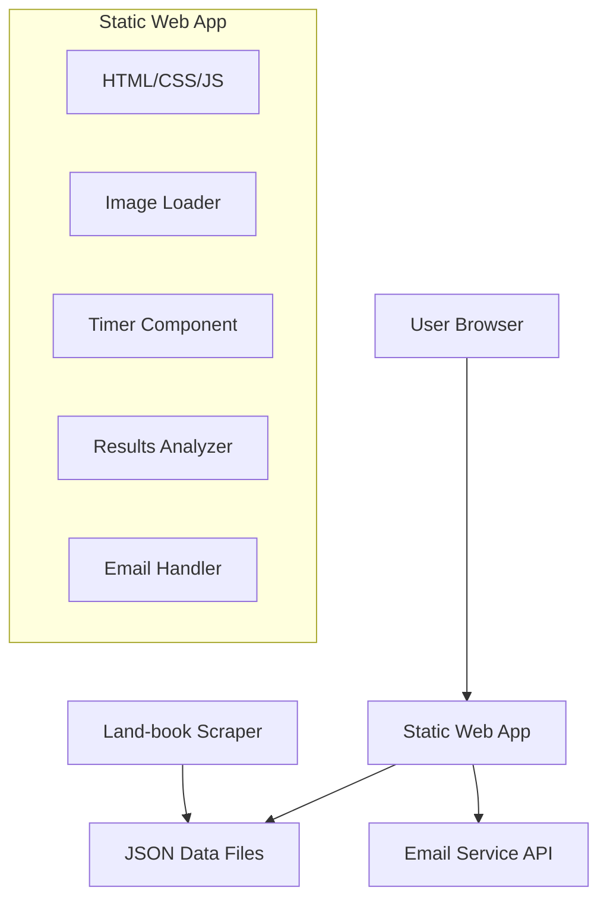

# Design Document

## Overview

The "This or That?" application is a single-page web application built with vanilla JavaScript, HTML, and CSS for maximum performance and simplicity. The application follows a client-side architecture with no backend dependencies, using static JSON files for data and third-party services for email functionality. The design prioritizes fast loading, intuitive user experience, and mobile responsiveness.

## Architecture

### High-Level Architecture



### Technology Stack

- **Frontend**: Vanilla HTML5, CSS3, JavaScript (ES6+)
- **Hosting**: Static site hosting (Netlify, Vercel, or GitHub Pages)
- **Data Storage**: Static JSON files served from `/data/` directory
- **Email Service**: EmailJS or Formspree for client-side email sending
- **Scraper**: Node.js with Puppeteer/Playwright for Land-book data extraction

### File Structure

```
this-or-that-app/
├── index.html
├── css/
│   ├── main.css
│   └── responsive.css
├── js/
│   ├── app.js
│   ├── timer.js
│   ├── results.js
│   └── email.js
├── data/
│   └── designs.json
├── scraper/
│   ├── scraper.js
│   ├── package.json
│   └── README.md
└── assets/
    └── icons/
```

## Components and Interfaces

### 1. Main Application Controller (app.js)

**Purpose**: Orchestrates the entire application flow and manages state.

**Key Methods**:

- `initializeApp()`: Loads JSON data and sets up initial state
- `loadNextPair()`: Selects and displays next image pair
- `handleSelection(imageId)`: Processes user choice and updates state
- `checkProgress()`: Determines if results should be shown

**State Management**:

```javascript
const appState = {
    designs: [],           // All loaded design data
    currentPair: [],       // Current two images being shown
    usedPairs: new Set(),  // Track shown pairs to avoid duplicates
    selections: [],        // User's choices with timestamps
    currentRound: 0,       // Current choice number
    isComplete: false      // Whether minimum choices reached
};
```

### 2. Timer Component (timer.js)

**Purpose**: Manages the 30-second countdown with visual feedback.

**Key Methods**:

- `startTimer()`: Begins countdown and visual progress
- `stopTimer()`: Halts timer when selection is made
- `resetTimer()`: Prepares timer for next round
- `onTimeout()`: Handles automatic progression when time expires

**Visual Elements**:

- Progress bar (top or bottom of screen)
- Remaining time display
- Color transitions (green → yellow → red)

### 3. Results Analyzer (results.js)

**Purpose**: Processes user selections to generate design preference profile.

**Key Methods**:

- `analyzeSelections()`: Processes all user choices
- `calculateTagFrequencies()`: Counts tag occurrences across categories
- `generateProfile()`: Creates ranked preference lists
- `formatResults()`: Prepares data for display

**Analysis Logic**:

```javascript
const analysisCategories = {
    style: [],
    industry: [],
    typography: [],
    type: [],
    category: [],
    platform: [],
    colors: []
};
```

### 4. Email Handler (email.js)

**Purpose**: Manages sending results via email using third-party service.

**Key Methods**:

- `initializeEmailService()`: Sets up EmailJS or Formspree
- `sendResults(userEmail, designerEmail, results)`: Sends formatted results
- `formatEmailContent()`: Creates professional email template
- `handleEmailResponse()`: Manages success/error feedback

### 5. Image Pair Selector

**Purpose**: Ensures diverse, non-duplicate image pairings.

**Selection Algorithm**:

1. Filter out previously shown pairs
2. Randomly select two different images
3. Ensure variety in tags/categories when possible
4. Track pair history to prevent repeats

## Data Models

### Design Object Structure

```javascript
{
    "id": "unique-identifier",
    "image": "https://cdn.land-book.com/path/to/image.webp",
    "title": "Website Name (optional)",
    "author": "Designer Name (optional)",
    "tags": {
        "style": ["Big Type", "Parallax", "Pastel Colors"],
        "industry": ["Education", "Health & Fitness"],
        "typography": ["Serif"],
        "type": ["Personal", "Service"],
        "category": ["Portfolio"],
        "platform": ["Framer"],
        "colors": ["#F8F2F0", "#161416", "#CEC8C5"]
    }
}
```

### Selection Record Structure

```javascript
{
    "timestamp": "2025-01-30T10:30:00Z",
    "selectedId": "design-123",
    "rejectedId": "design-456",
    "timeToDecision": 12.5, // seconds
    "roundNumber": 15
}
```

### Results Profile Structure

```javascript
{
    "totalSelections": 25,
    "completedAt": "2025-01-30T10:45:00Z",
    "preferences": {
        "style": [
            {"tag": "Minimalist", "frequency": 18, "percentage": 72},
            {"tag": "Bold Typography", "frequency": 12, "percentage": 48}
        ],
        "industry": [...],
        "typography": [...],
        "colors": [...]
    },
    "topRecommendations": [
        "Clean, minimalist designs with bold typography",
        "Neutral color palettes with accent colors",
        "Portfolio-style layouts"
    ]
}
```

## Error Handling

### Image Loading Failures

- Implement lazy loading with fallback mechanisms
- Skip broken images and load next available pair
- Display loading states and error messages
- Preload next images in background

### Network Issues

- Cache JSON data in localStorage for offline capability
- Graceful degradation when email service unavailable
- Retry mechanisms for failed requests
- User feedback for connectivity issues

### Data Validation

- Validate JSON structure on load
- Handle missing or malformed tag data
- Ensure minimum dataset size for meaningful results
- Sanitize user input for email addresses

## Testing Strategy

### Unit Testing

- Timer functionality and edge cases
- Results analysis algorithms
- Image pair selection logic
- Email formatting and validation

### Integration Testing

- End-to-end user flow from start to results
- Email service integration
- JSON data loading and parsing
- Cross-browser compatibility

### User Experience Testing

- Mobile responsiveness across devices
- Touch interaction reliability
- Timer visibility and clarity
- Results readability and usefulness

### Performance Testing

- Image loading optimization
- Memory usage during extended sessions
- Bundle size and load times
- Third-party service response times

## Security Considerations

### Data Privacy

- No personal data stored locally or remotely
- Session data cleared on browser close
- Email addresses not retained after sending
- Compliance with privacy regulations

### Content Security

- Validate image URLs before loading
- Implement Content Security Policy headers
- Sanitize all user inputs
- Use HTTPS for all external requests

### Third-Party Services

- Secure API key management for email service
- Rate limiting to prevent abuse
- Fallback options if services unavailable
- Regular security updates for dependencies

## Visual Design Specifications

### Color Scheme

- **Background**: Pure white (#FFFFFF)
- **Text**: System default colors for optimal readability
- **Accents**: Minimal use of color, primarily for timer progress and interactive elements

### Typography

- **Font Family**: System default font stack for optimal performance and native feel

  ```css
  font-family: -apple-system, BlinkMacSystemFont, 'Segoe UI', Roboto, Oxygen, Ubuntu, Cantarell, sans-serif;
  ```

- **Hierarchy**: Clear typographic hierarchy using font weights and sizes
- **Readability**: High contrast ratios for accessibility compliance

### Layout Principles

- Clean, minimal interface focusing attention on image pairs
- Generous whitespace for visual breathing room
- Consistent spacing and alignment
- Mobile-first responsive design

## Performance Optimizations

### Image Handling

- WebP format with fallbacks
- Responsive image sizing
- Progressive loading
- Compression optimization

### Code Optimization

- Minification and bundling
- Tree shaking for unused code
- Lazy loading of non-critical components
- Service worker for caching

### User Experience

- Smooth transitions between pairs
- Preloading next images
- Optimistic UI updates
- Minimal layout shifts
